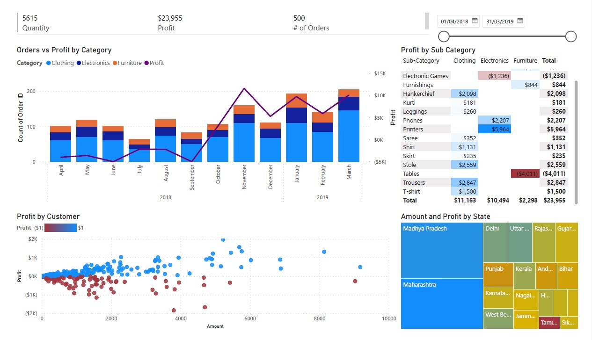

# Kemi's BI-Dashboards Portfolio

# [Project 1: Profitability Analysis Using Power BI](https://drive.google.com/file/d/1IppUJsQNDVFO0C9AyMTPv-eQPmuG0Ixy/view?usp=sharing)

In this project, I analyzed the performance of a company’s product lines to identify areas for improvement and enhance overall profitability.

**Data Story Objectives:**

*  Goal: Review Current Product Lines
*  Users: Finance Team
*  Actions: Identify low-performing products and regions as well as areas for revenue improvement
*  Usage Frequency: Monthly

**Key Performance Indicators (KPIs):**
1.	Profit
2.	Quantity
3.	Order Volume

**Steps Taken:**

Load and Transform Data

Join Data

Visualize Data [here](https://drive.google.com/file/d/12Jvf1eskCjuLvB2J1vkahYhX2r-jAz9f/view?usp=sharing)
*  KPIs Chart using Multi-row card
*  Profit Trend Chart using Line and stacked column chart
*  Profit by Category Chart using Matrix chart
*  Profitability by Customer Chart using Scatter chart
*  Profit by State Chart using Tree map
*  Profit Insights Page that includes an enhanced scatter chart for interactive analysis, Key Influencers chart for deeper insights and Q&A chart for ad hoc analysis.
*  Slicers and Filters
## Image 1    

Recommendations
1.	Expand profitable sub-categories
2.	Consider not selling unprofitable sub-categories
3.  Review the most unprofitable customers and underperforming states.

**Project and Dataset Acknowledgements**
The knowledge applied in this project was learned from Codecademy’s BI Dashboards with Power BI course, using the E-commerce Data dataset from Kaggle. https://www.kaggle.com/datasets/benroshan/ecommerce-data

