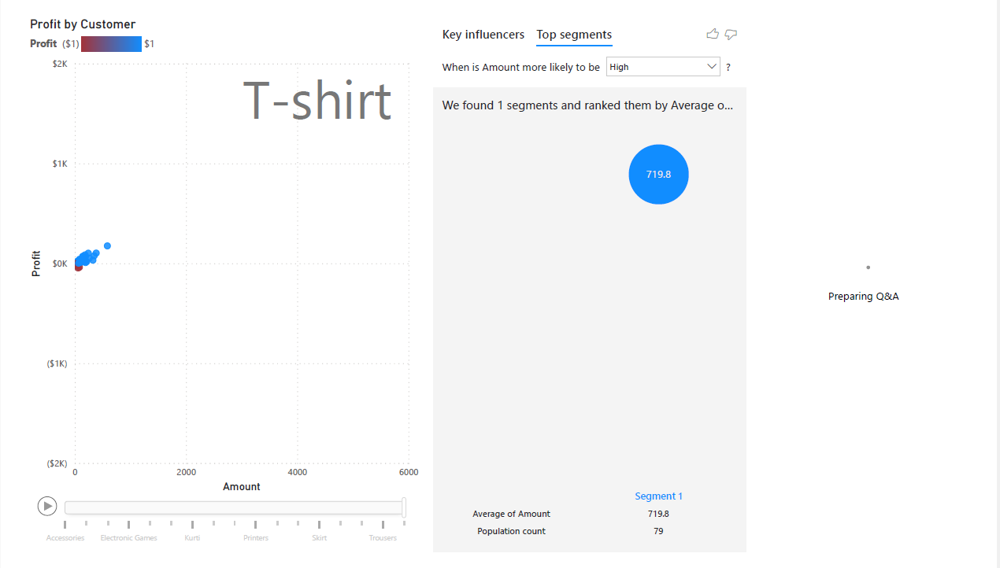
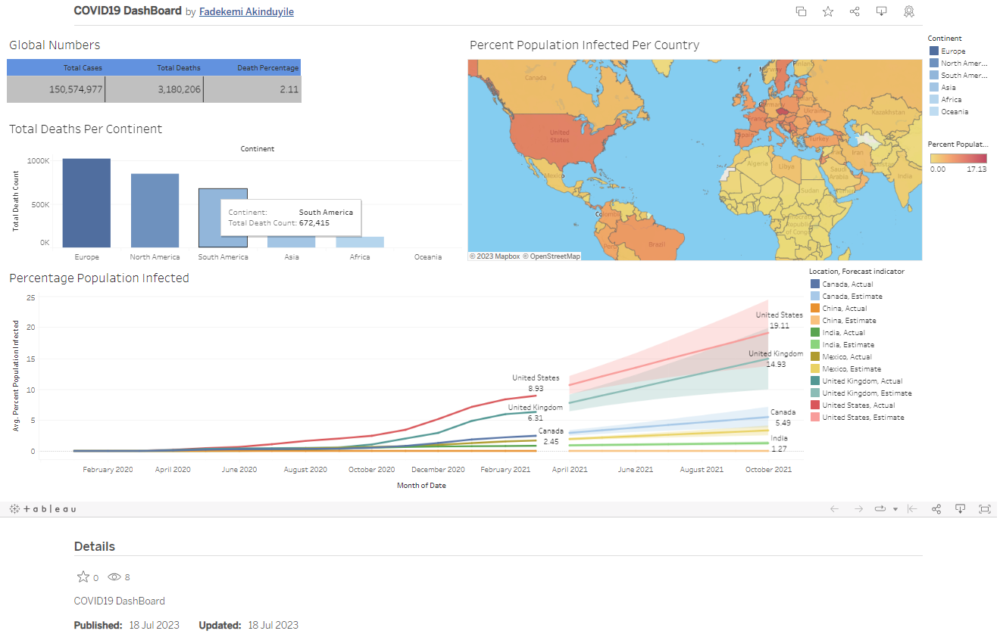
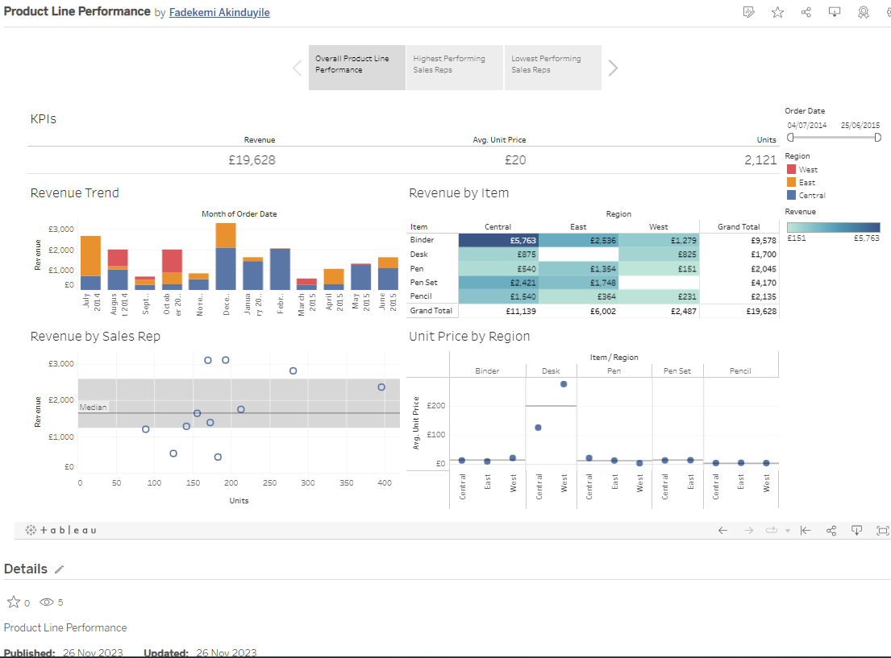

# Kemi's Portfolio

# [Project 1: Profitability Analysis Using Power BI](https://drive.google.com/file/d/1IppUJsQNDVFO0C9AyMTPv-eQPmuG0Ixy/view?usp=sharing)

In this project, I analyzed the performance of a company’s product lines to identify areas for improvement and enhance overall profitability.

**Data Story Objectives:**

*  Goal: Review Current Product Lines
*  Users: Finance Team
*  Actions: Identify low-performing products and regions as well as areas for revenue improvement
*  Usage Frequency: Monthly

**Key Performance Indicators (KPIs):**
1.	Profit
2.	Quantity
3.	Order Volume

**Steps Taken:**

Load and Transform Data

Join Data

Visualize Data [here](https://drive.google.com/file/d/12Jvf1eskCjuLvB2J1vkahYhX2r-jAz9f/view?usp=sharing)
*  KPIs Chart using Multi-row card
*  Profit Trend Chart using Line and stacked column chart
*  Profit by Category Chart using Matrix chart
*  Profitability by Customer Chart using Scatter chart
*  Profit by State Chart using Tree map
*  Profit Insights Page that includes an enhanced scatter chart for interactive analysis, Key Influencers chart for deeper insights and Q&A chart for ad hoc analysis.
*  Slicers and Filters

 
 
 

**Recommendations:**
1.	Expand profitable sub-categories
2.	Consider not selling unprofitable sub-categories
3.  Review the most unprofitable customers and underperforming states.

**Project and Dataset Acknowledgements:**

The knowledge applied in this project was learned from Codecademy’s BI Dashboards with Power BI course, using the E-commerce Data dataset from Kaggle. https://www.kaggle.com/datasets/benroshan/ecommerce-data

# [Project 2: Data Exploration and Visualization using Tableau](https://public.tableau.com/app/profile/fadekemi.akinduyile/viz/COVID19DashBoard_16897023854090/Dashboard1)

In this project, I explored COVID-19 data, specifically focusing on total cases, deaths, vaccination rates, and their relationships.

**Steps Taken:**

* SQL Queries and Analysis: I performed data exploration using these SQL queries on the COVID-19 dataset. View [here](https://github.com/FadekemiAkinduyile/SQL-Data-Projects/blob/main/SQLQuery%20-%20COVID19%20Project.sql)

* Tableau Dashboard: I created a dashboard in Tableau. The Tableau dashboard provides visualizations on total cases, deaths, vaccination rates, and their trends. View [here](https://public.tableau.com/app/profile/fadekemi.akinduyile/viz/COVID19DashBoard_16897023854090/Dashboard1)

**How to Use:**

1. Execute the SQL queries in a SQL Server environment with the provided dataset.
2. Open the TableauDashboard.twb file in Tableau to explore the visualizations.

**Acknowledgments:**

This project used in this project was obtained from https://ourworldindata.org/covid-deaths.

The knowledge applied was learned from Alex The Analyst's tutorial.

https://www.youtube.com/watch?v=qfyynHBFOsM&list=PLUaB-1hjhk8H48Pj32z4GZgGWyylqv85f&index=2

https://www.youtube.com/watch?v=8rO7ztF4NtU&list=PLUaB-1hjhk8H48Pj32z4GZgGWyylqv85f&index=4

# [Project 2: Product Line Performance - Data Story using Tableau](https://public.tableau.com/app/profile/fadekemi.akinduyile/viz/ProductLinePerformance_17010292790450/ProductLinePerformance)

In this project, I analyzed the performance of a company's product lines, with the aim of identifying areas for improvement and determine the best-selling products. This analysis is based on 12 months of data for 5 product lines, 3 regions, and 11 sales reps.

**Data Story Objectives:**

*  Goal: Review current product lines and identify areas for improvement
*  Users: Finance Team
*  Actions:   - Identify revenue improvement areas  - Identify low-performing sales reps and regions  - Identify variance in product pricing
*  Usage Frequency: Monthly

**Key Performance Indicators (KPIs):**
1.	Revenue
2.	Units
3.	Unit Price

**Steps Taken:**

Load Data. Link [here](https://www.kaggle.com/datasets/fmendes/office-supply-sales)

Visualize Data [here](https://public.tableau.com/app/profile/fadekemi.akinduyile/viz/ProductLinePerformance_17010292790450/ProductLinePerformance)
* KPIs by displaying Revenue ([Unit Price] * [Units]), Units, and Unit Price.
* Revenue Trend
* Revenue by Item using heatmap of Revenue by Item and Region.
* Revenue by Sales Rep, that is, sales rep performance using scatter plot.
* Comparison chart for average Unit Price across regions.
* Dashboard Creation by assemblying all sheets in a Z pattern layout.
* Applied date range filters to the dashboard for better analysis.
* Story Creation - Built a story with three tabs: Overall Product Line Performance, Highest Performing Sales Reps, and Lowest Performing Sales Reps.

**Results:**

This data analysis provides insights into revenue, unit volume, and unit pricing for different product lines, regions, and sales reps.

**Project and Dataset Acknowledgements:**

The knowledge applied in this project was learned from Codecademy’s BI Dashboards with Tableau course, using the Office Supply Sales dataset from Kaggle. https://www.kaggle.com/datasets/fmendes/office-supply-sales

